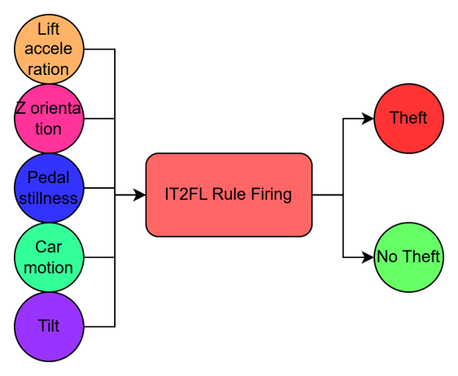
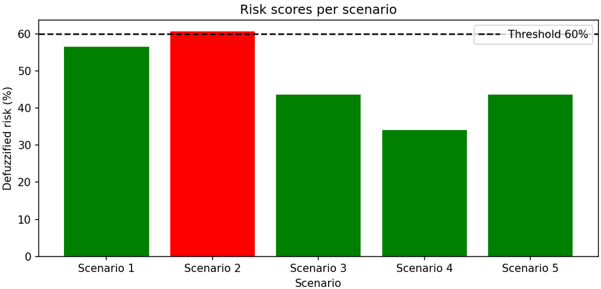

This project is a novel Interval Type2 Fuzzy Logic System (IT2FLS) for theft detection in e-bikes, leveraging accelerometer-derived features including lift acceleration, tilt, pedal stillness, car motion, and z-axis orientation. By applying a fuzzy inference framework that accounts for sensor uncertainty, the system generates a defuzzified theft risk score, enabling distinct differentiation between theft-like behaviour and
normal usage such as parking maneuvers.

[BouwTag](https://bouwtag.nl/) and [Bypoint](https://bypoint.nl/) are two innovative companies in the Netherlands working together to make tracking and protecting valuable items easier and smarter. 

The sensor tracking device (4799 StreamLine LoRa FSK Security) is designed for long battery life of up to five years, equipped with a tamper detection strip, making it perfect for securing valuable assets even in harsh environments

## Methodology

Main input features extracted from accelerometer
data: pedal stillness, car motion, lift acceleration, lift orientation, and Z-axis orientation

## Results

The risk distribution provides brief insight into how the fuzzy system assessed 5 scenarios. A dashed line at the 60% risk threshold separates predictions labeled as theft from those labeled as non-theft. In this test, only the theft scenario produced a risk score above the threshold, while all normal scenarios stayed below it. This distinct separation suggests that the system is capable of differentiating theft-like events from regular activities based on sensor patterns.

All implementaton details full results are in the paper and has been submitted for publication.
